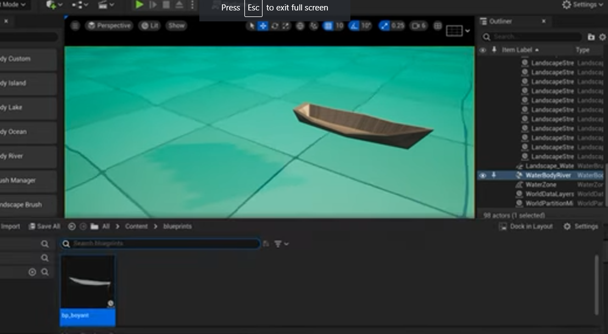
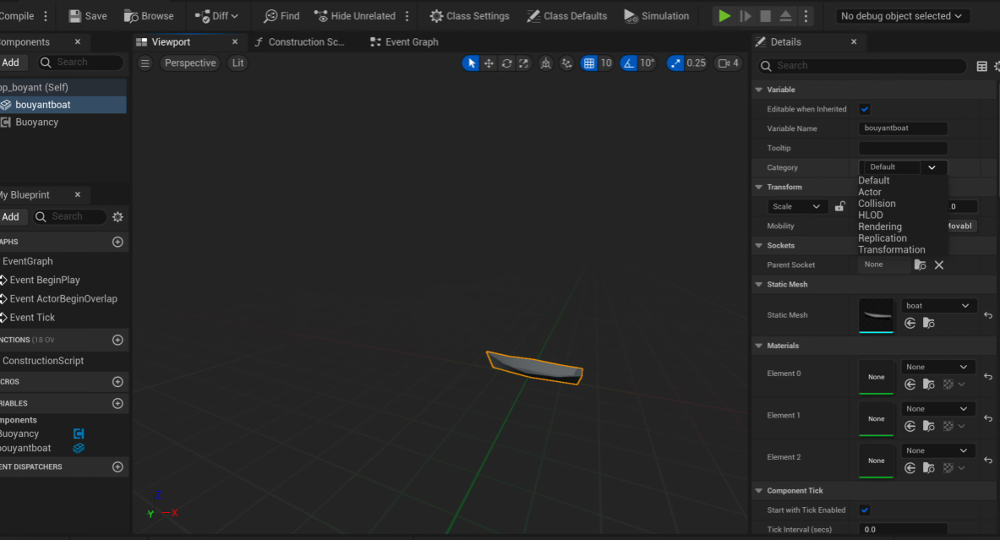
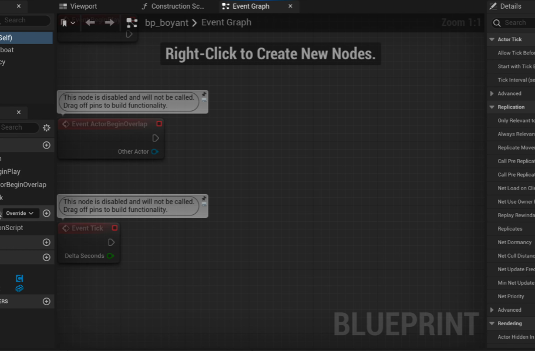

# Import-Boat-Object-Created-from-Maya-to-Unreal-Engine-and-Float-it-on-the-Ocean

Name: P.Siva Naga Nithin.

Reg.No: 212221240037.

## Aim:
To create a boat in Maya and make it floating in unreal engine.

## Procedure:

Step1: Create a new project in Maya.

Step2: From polygons drag and drop cube.

Step3: By using extrude, insert edge tool and other tools shape the cube into a basic boat.

Step4: Add texturing to the Boat that is created.

Step5: Export the boat to a file.

Step6: Now open unreal engine and import the boat file to the content folder.

Step7 :Create a new landscape in the unreal engine and add water body to it.

Step8: Create a new blue print class of actor and name it float boat.

Step9: Open the blue print and add a static mesh and change the texture to the boat that is imported. 10 From add components add Buoyancy to the blue print and create few points so that boat stay floating.
Step10: Drag and drop the created blue print on to the landscape water body.

Step11: Press play button now the boat starts floating the waterbody.

## Output:

## YouTube:
 https://youtu.be/lL6vBS1OlH8
 
 ## Result:
  Thus Boat Object is from Maya to Unreal Engine and Float it on the Ocean is Created.
